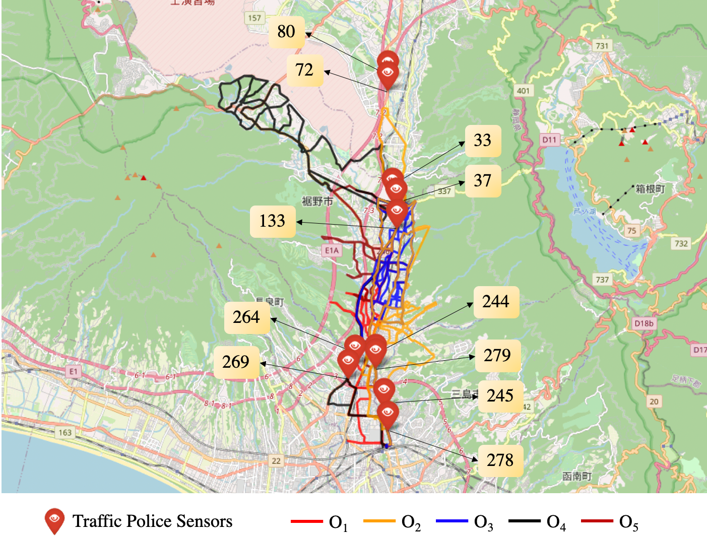

## Experiment Data

- Experiment videos with GPS of five observers is made publicly available and hosted on AWS S3 (Asia-Pacific, Tokyo) bucket.

- All observers' video and GPS are provided separately for convenience.

- You require some processing on how to associate GPS logs to the video files. All video files have timestamp laid on top for verification. 

<p align="center"></p>

## Download links

- Pre-processed GPS data matching number of frames in the video.[All GPS processed](https://drive.google.com/drive/folders/1KEt-T6hShZL0OlSt0AKW6cVywhg8lsYE?usp=sharing)

- [Observer-1 (Video)](https://sekilab-students.s3.ap-northeast-1.amazonaws.com/Ash-PhD/dataset/susono_processed/Device-1.mp4) |
 [(GPS)](https://sekilab-students.s3.ap-northeast-1.amazonaws.com/Ash-PhD/dataset/susono_processed/Device-1.log)

- [Observer-2 (Video)](https://sekilab-students.s3.ap-northeast-1.amazonaws.com/Ash-PhD/dataset/susono_processed/Device-2.mp4) |
 [(GPS)](https://sekilab-students.s3.ap-northeast-1.amazonaws.com/Ash-PhD/dataset/susono_processed/Device-2.log)


- [Observer-3 (Video)](https://sekilab-students.s3.ap-northeast-1.amazonaws.com/Ash-PhD/dataset/susono_processed/Device-3.mp4) |
[(GPS)](https://sekilab-students.s3.ap-northeast-1.amazonaws.com/Ash-PhD/dataset/susono_processed/Device-3.log)


- [Observer-4 (Video)](https://sekilab-students.s3.ap-northeast-1.amazonaws.com/Ash-PhD/dataset/susono_processed/Device-4.mp4) |
[(GPS)](https://sekilab-students.s3.ap-northeast-1.amazonaws.com/Ash-PhD/dataset/susono_processed/Device-4.log)

- [Observer-5 (Video)](https://sekilab-students.s3.ap-northeast-1.amazonaws.com/Ash-PhD/dataset/susono_processed/Device-5.mp4) |
[(GPS)](https://sekilab-students.s3.ap-northeast-1.amazonaws.com/Ash-PhD/dataset/susono_processed/Device-5.log)


## Citation

```csv
@inproceedings{kumar2021citywide,
  title={Citywide reconstruction of cross-sectional traffic flow from moving camera videos},
  author={Kumar, Ashutosh and Kashiyama, Takehiro and Maeda, Hiroya and Sekimoto, Yoshihide},
  booktitle={2021 IEEE International Conference on Big Data (Big Data)},
  pages={1670--1678},
  year={2021},
  organization={IEEE}
}
```
