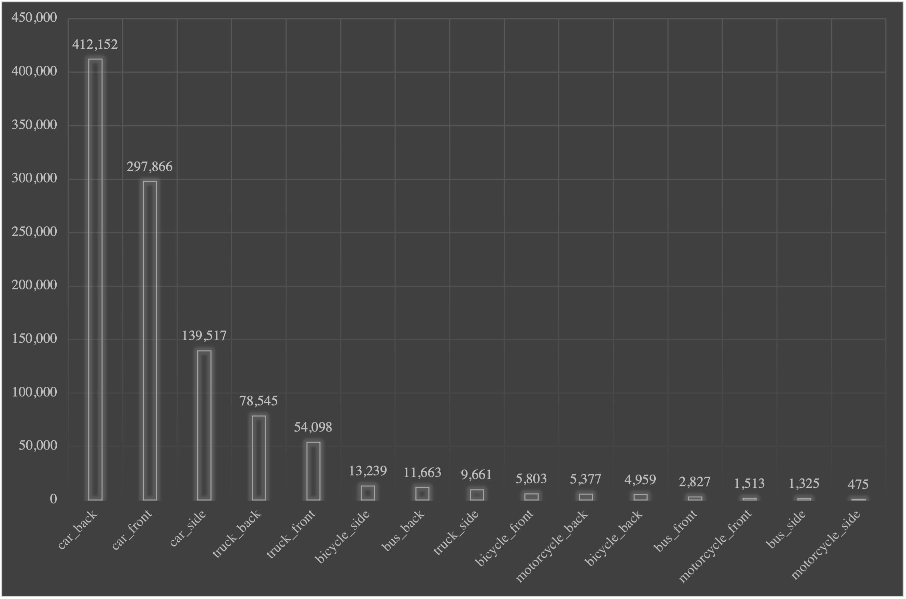

<div id="top"></div>

[![Paper link][modified-shield]][paper-url]
[![Forks][forks-shield]][forks-url]
[![Stargazers][stars-shield]][stars-url]
[![Issues][issues-shield]][issues-url]
[![MIT License][license-shield]][license-url]


<!-- PROJECT LOGO -->
<br />
<div align="center">
  <a href="https://github.com/sekilab/VehicleOrientationDataset">
    
  </a>

  <h3 align="center">The Vehicle Orientation Dataset</h3>

  <p align="center">
    The vehicle orientation dataset contains more than one million annotations of vehicles with orientation in more than 200,000 images. It reduces the need of a secondary neural network to classify orientation by simultaneously providing both vehicle class and direction. Here is our published paper at IEEE International Conference on Big Data 2021:
    <br />
    <a href="http://dx.doi.org/10.1109/BigData52589.2021.9671751"><strong>Citywide reconstruction of cross-sectional traffic flow from moving camera videos»</strong></a>
    <br />
    <br />
    ·
    <a href="#dataset">Download Vehicle Orientation Dataset</a>
    ·
    <a href="Experiment.md">Download Experiment Dataset (Video and GPS)</a>
    
  </p>
</div>

## Trained models: To be updated after March 15th, 2022
 - YOLOv4 trained model on augmented vehicle orientation dataset containing more than six million images.
 - YOLOv4 trained model on withoug pixel level augmentation.
 - Several state-of-the-art object-detection neural networks model will be uploaded soon.
 - A new synthetic vehicle orientation dataset prepared in CARLA driving simulator and models.

## Annotation style

<p align="center"></p>

All vehicles in the vehicle orientation dataset are labeled with both `vehicle class` (five categories) and its `orientation` (three types).

The five classes of vehicles are:
- Car
- Bus
- Truck
- Motorcycle
- Bicycle

The three types of orientations are:

- Front
- Back
- Side

So the vehicle orientation dataset has a total of 15 classes of vehicles with orientation such `car_back`, `car_front`, `car_side`, `bus_back`, `bus_front`, etc.

Annotations per class in the vehicle orientation dataset follows the long-tail distribution as commonly seen in other vehicle detection data sets.

<p align="center"></p>

<div id="dataset"></div>
<!-- Download dataset -->

## Download Dataset

The vehicle orientation dataset is hosted on AWS S3 (Asia-pacific, Tokyo) bucket. Since the overall size of the dataset is quite big (~100GB), we have split the vehicle orientation dataset into five parts for convenience of users. Part 1 to Part 4 together contain `200,000 images` (50,000 x 4) and Part 5 has `13,714 images`. <br>
Please note that the annotations are provided in `YOLO` format style ([darknet](https://github.com/AlexeyAB/darknet)). There is a `.txt`-file for each `.jpg`-image-file - in the same directory and with the same name. Each line contains the class and bounding box coordinates for a vehicle in the image. If there are multiple vehicles in the image, the number of lines will increase accordingly.

`<object-class> <x_center> <y_center> <width> <height>`

where:

- `<object-class>` - integer object number from `0` to `(classes-1)`. Mapping file can be downloaded from here: [Vehicle Orientation Classes](data/vehicle_orientation.names)
- `<x_center> <y_center> <width> <height>` - float values **relative** to width and height of image, it can be equal from `(0.0 to 1.0]`
- For example: `<x> = <absolute_x> / <image_width>` or `<height> = <absolute_height> / <image_height>`
- Attention: `<x_center> <y_center>` - are center of rectangle (Not top-left corner)

For example, for `SUG007M5MX5JAZGUI4EI.jpg` in vehicle-orientation-5 we have the corresponding annotation file `SUG007M5MX5JAZGUI4EI.txt` containing:

  ```csv
2 0.650000 0.573148 0.018750 0.027778
6 0.864062 0.449537 0.265625 0.793519
1 0.300000 0.581481 0.068750 0.051852
0 0.558594 0.625463 0.110937 0.217593
  ```
The first column represents the class such as `car_front`, `car_back`, etc. `2` in the first row means car_front, `6` in the second row is truck_back, and so on. Please check [Vehicle Orientation Classes](data/vehicle_orientation.names) file for all 15 classes.


### Download links

- [Part-1, 50,000 images](https://sekilab-students.s3.ap-northeast-1.amazonaws.com/2021/vehicle-orientation-dataset/vehicle-orientation-1.zip)
- [Part-2, 50,000 images](https://sekilab-students.s3.ap-northeast-1.amazonaws.com/2021/vehicle-orientation-dataset/vehicle-orientation-2.zip)
- [Part-3, 50,000 images](https://sekilab-students.s3.ap-northeast-1.amazonaws.com/2021/vehicle-orientation-dataset/vehicle-orientation-3.zip)
- [Part-4, 50,000 images](https://sekilab-students.s3.ap-northeast-1.amazonaws.com/2021/vehicle-orientation-dataset/vehicle-orientation-4.zip)
- [Part-5, 13,714 images](https://sekilab-students.s3.ap-northeast-1.amazonaws.com/2021/vehicle-orientation-dataset/vehicle-orientation-5.zip)


<!-- LICENSE -->
## License

Distributed under the MIT License. See `LICENSE.txt` for more information.


<!-- CONTACT -->
## Contact

For any question and support, please create an issue on GitHub or write to the author here:

Ashutosh Kumar  - ashutosh[at]iis.u-tokyo.ac.jp


## Citation
```csv
@inproceedings{kumar2021citywide,
  title={Citywide reconstruction of cross-sectional traffic flow from moving camera videos},
  author={Kumar, Ashutosh and Kashiyama, Takehiro and Maeda, Hiroya and Sekimoto, Yoshihide},
  booktitle={2021 IEEE International Conference on Big Data (Big Data)},
  pages={1670--1678},
  year={2021},
  organization={IEEE}
}
```
<p align="right">(<a href="#top">Back to top</a>)</p>

<!-- ACKNOWLEDGMENTS -->
<!-- MARKDOWN LINKS & IMAGES -->
<!-- https://www.markdownguide.org/basic-syntax/#reference-style-links -->
[contributors-shield]: https://img.shields.io/github/contributors/sekilab/VehicleOrientationDataset
[contributors-url]: https://github.com/sekilab/VehicleOrientationDataset/graphs/contributors
[forks-shield]: https://img.shields.io/github/forks/sekilab/VehicleOrientationDataset
[forks-url]: https://github.com/sekilab/VehicleOrientationDataset/network/members
[stars-shield]: https://img.shields.io/github/stars/sekilab/VehicleOrientationDataset
[stars-url]: https://github.com/sekilab/VehicleOrientationDataset/stargazers
[issues-shield]: https://img.shields.io/github/issues/sekilab/VehicleOrientationDataset
[issues-url]: https://github.com/sekilab/VehicleOrientationDataset/issues
[license-shield]: https://img.shields.io/github/license/sekilab/VehicleOrientationDataset
[license-url]: https://github.com/sekilab/VehicleOrientationDataset/blob/main/LICENSE.txt
[modified-shield]: https://img.shields.io/github/last-commit/sekilab/VehicleOrientationDataset/main
[paper-url]: https://github.com/sekilab/VehicleOrientationDataset/commits/main
[product-screenshot]: media/sample_annotations.png
